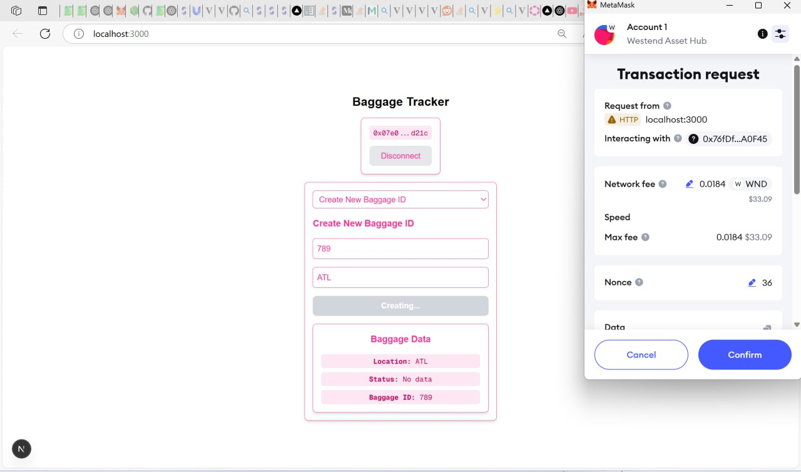

# AirTrace


Welcome to AirTrace, a decentralized application (dApp) built on the Polkadot Asset Hub to track and update baggage information using blockchain technology. This project enables customers and baggage handlers to interact securely with baggage data through a user-friendly interface.


## View to a transaction completed via our smart contract:
https://assethub-westend.subscan.io/tx/0xd01a37d04dbb6ab1fcff45df30b9e2b5117d167bce4a40d0b62dd3baea863f20?ref=hackernoon.com


## 📽️ Demo Video

- [Click here to watch the full demo video with explanation](https://www.loom.com/share/cda2bcb4eaac4566a35da4afb68388e6?sid=1386fd06-d682-4dbc-819d-0b17990a8a50)

*(Replace with your Loom or YouTube video link.)*

---

## 🖼️ UI Screenshots

| Screen | Screenshot |
|:------|:------------|
| Home Page (Connect Wallet) |  |
| Customer View (View Location) |  |
| Handler View (Update Location/Stage) |  |


*(Create a `/screenshots/` folder in your repo and upload your screenshots there.)*

---
## Smart Contract Functionality: 
 The smart contract is written in solidity and deployed via the Remix IDE.\
 The smart contract has two main functionalities: **To view the baggage information, and then to update the baggage information** (With more time, functionality would be added that ensures checks that ONLY verified baggage handlers can update baggage information)
 
 Here we have the functions: ``` storeBaggage , updateLocation, getBaggage ,completeBaggage```.  ```storeBaggage``` provides a way to create a new Baggage instance by assigning a BaggageID and initial airport location to a new instance of the "Baggage" structure; ```updateLocation``` a method to update the airport location and Location status (e.g. check-in,on plane, transfer, arrival), ```getBaggage``` a method to look at the location and location status given a baggage id (Baggage ID's will be generated with secure methods in later versions- currently accept any abitrary string), lastly ```completeBaggage``` was a later functionality such that upon baggage arrival to the final airport, the Baggage structure would have the ```completed``` bool become true, signifiying that specific baggage had been collected. 


---

## 🛠️ How the Frontend Works

The frontend was built using **Next.js**, **React**, **TailwindCSS**, and **Viem**:

- Users **connect their MetaMask wallet** to the dApp.
- Handlers can **create** or **update** baggage information, signing blockchain transactions through MetaMask.
- Customers can **view baggage location and stage** by simply entering the Baggage ID (no transaction or gas fees required).
- We used **Viem's publicClient** for reading contract state and **walletClient** for signing transactions.
- Everything is deployed over Polkadot’s **Asset Hub**, taking advantage of **low gas fees**, **fast finality**, and **EVM compatibility**.

---

## 🔎 Block Explorer Link

- [View Deployed Smart Contract on Asset Hub Explorer](https://assethub-westend.subscan.io/tx/0xd01a37d04dbb6ab1fcff45df30b9e2b5117d167bce4a40d0b62dd3baea863f20?ref=hackernoon.com)


---

## 🎥 Video Tour of Code + Repo Structure

- [Click here to watch the full code explanation video](https://www.loom.com/share/b7ef8e7332b640e0acdaf18f0ce79b63?sid=04f2d777-e5b6-40a7-80dd-2c8bd766f229)

The video includes:
- Full demo of the frontend working
- How the GitHub repo is structured (contracts, utils, components)
- How we satisfied point 7 (Polkadot EVM interaction via Viem and MetaMask)
- How the smart contract interacts with the frontend
- Explanation of any challenges faced and solved

---
